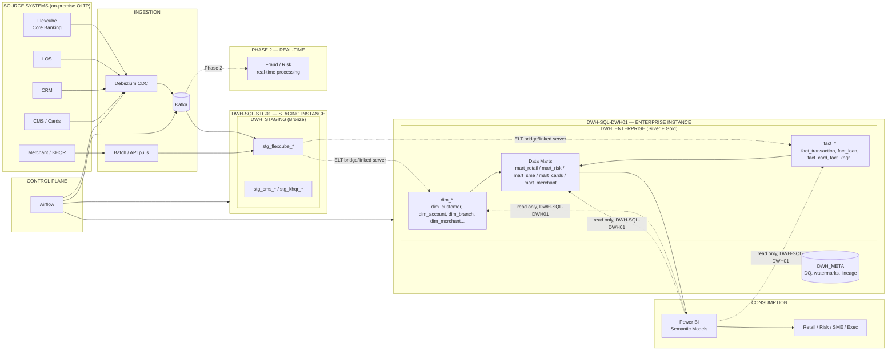

# Sathapana Bank — Data Warehouse Final Technical Specification (FINAL_SPEC)

| Item | Value |
|---|---|
| **Document** | DWH Technical & Architecture Specification — **FINAL** |
| **Version** | 1.1 (Update: two-instance topology — staging + enterprise) |
| **Status** | Approved for implementation (Baseline) |
| **Owner** | Data Engineering & Architecture (Sathapana Bank) |
| **Date** | 2026-09-13 |
| **Audience** | Data Engineering, Data Architecture, BI, Infrastructure, Risk & Compliance |

> This FINAL_SPEC reconciles the initial design (SPEC.md) with the detailed architecture review
> documented in `Chatgpt_Details.md`. The review confirmed and refined the design for an
> **on-premise** Sathapana Bank. Key outcome: **Medallion (Bronze/Silver/Gold) is adopted as
> logical layers, physically implemented as a traditional on-premise SQL Server DWH**
> (Staging DB → Enterprise DWH with Dimensions/Facts → Data Mart schemas),
> running on **two dedicated SQL Server instances: `DWH-SQL-STG01` (staging) and
> `DWH-SQL-DWH01` (enterprise)** for workload & security isolation.

---

## Table of Contents

1. [Purpose & Objectives](#1-purpose--objectives)
2. [Scope](#2-scope)
3. [Design Decisions & Rationale (ADR Log)](#3-design-decisions--rationale-adr-log)
4. [Reference Architecture (Final)](#4-reference-architecture-final)
5. [Source Systems](#5-source-systems)
6. [Data Ingestion — CDC, Kafka & Batch](#6-data-ingestion--cdc-kafka--batch)
7. [Logical Layers: Bronze / Silver / Gold](#7-logical-layers-bronze--silver--gold)
8. [Physical SQL Server Design](#8-physical-sql-server-design)
9. [ELT Strategy](#9-elt-strategy)
10. [Airflow Orchestration & Scheduling](#10-airflow-orchestration--scheduling)
11. [Data Model Design (Facts & Dimensions)](#11-data-model-design-facts--dimensions)
12. [Data Marts — Gold Datasets & Domain Marts](#12-data-marts--gold-datasets--domain-marts)
13. [Power BI Reporting](#13-power-bi-reporting)
14. [Data Quality](#14-data-quality)
15. [Governance, Security & Compliance](#15-governance-security--compliance)
16. [Metadata, Lineage & Catalog](#16-metadata-lineage--catalog)
17. [Monitoring, Observability & Alerting](#17-monitoring-observability--alerting)
18. [SLAs & Batch Window](#18-slas--batch-window)
19. [Backup, DR & Retention](#19-backup-dr--retention)
20. [Naming Conventions & Standards](#20-naming-conventions--standards)
21. [Environments & CI/CD](#21-environments--cicd)
22. [Roadmap: Phased Delivery](#22-roadmap-phased-delivery)
23. [Risks & Mitigations](#23-risks--mitigations)
24. [Glossary](#24-glossary)
25. [Open Questions](#25-open-questions)

---

## 1. Purpose & Objectives

Establish a **single, governed enterprise Data Warehouse** for Sathapana Bank that turns on-premise
source data into trusted, analysis-ready information for BI, reporting, regulatory returns and AI.

### Objectives

1. **Single Source of Truth** across retail, SME and corporate banking (deposits, loans, cards, payments/KHQR).
2. **NBC (National Bank of Cambodia) regulatory reporting** from auditable Gold/mart datasets.
3. **360° customer view** linking Customer ↔ Account ↔ Loan ↔ Card ↔ Merchant/Payment data.
4. **Operational-source protection**: never query production directly — ingest via CDC (Debezium/Kafka) and/or controlled batch.
5. **On-premise-first**: pragmatic, cost-effective DWH foundation leveraging existing SQL Server skills; evolution to real-time/lakehouse only when justified (§22).
6. **Self-service BI** on Power BI over governed semantic models.

### Success Criteria

| KPI | Target |
|---|---|
| CDC ingestion latency (source → staging) | ≤ 15 min |
| Daily Silver/Gold availability | T+1 04:00 Phnom Penh |
| Power BI refresh complete | T+1 05:00 |
| Data completeness per load | ≥ 99.9% |
| DQ pass rate (first run) | ≥ 95%, trending to 99% |
| GL reconciliation (source vs DWH) | 100% matched daily |

---

## 2. Scope

### In Scope (Phase 1)

- CDC/batch ingestion from Flexcube (Core Banking), LOS, CRM, CMS (Cards), plus Merchant/KHQR payment data.
- Two on-premise SQL Server **instances**: `DWH-SQL-STG01` (staging) and `DWH-SQL-DWH01` (enterprise), hosting `DWH_STAGING` and `DWH_ENTERPRISE` respectively.
- Enterprise dimensions & facts (conformed, Kimball-style star schema).
- Data Mart schemas (Retail, Risk, SME, Cards, Merchant).
- Airflow orchestration, DQ framework, governance, monitoring.
- Power BI semantic models & reports.
- Regulatory mart foundation (NBC, Credit Bureau Cambodia, AML excerpts).

### Out of Scope (Phase 1 — deferred to Phase 2/3)

- Real-time fraud/risk processing on Kafka (Phase 2).
- Lakehouse / unstructured data platform (Phase 3, conditional).
- Dedicated MDM tooling (lightweight conformed dims handled in Silver).

---

## 3. Design Decisions & Rationale (ADR Log)

| ADR | Decision | Rationale (from architecture review) |
|---|---|---|
| **D-1** | **Traditional on-premise DWH first, NOT lakehouse.** | Sathapana's source data lives in **on-premise databases**, and near-term needs are structured reporting/analytics/regulatory. A lakehouse adds infrastructure cost/complexity without immediate benefit. Lakehouse is deferred to Phase 3. |
| **D-2** | **Bronze/Silver/Gold = logical layers, not separate physical stores.** | Medallion describes *data maturity*, not hardware/software location. They map cleanly onto on-premise DWH stages (Staging / Enterprise DWH / Marts). Prevents the mistake of "Bronze = one database, Silver = another". |
| **D-3** | **Airflow as orchestrator** (not SSIS, not Apache Hop). | Airflow is a workflow **orchestrator** ("when/what order"), SSIS/Hop are **ETL engines** ("how to move/transform"). Airflow gives superior scheduling, dependency & retry management and Python/ecosystem integration. SSIS is not recommended for a **new** platform; existing SSIS estate (if any) could be orchestrated by Airflow rather than replaced. |
| **D-4** | **SQL Server as the transformation engine (ELT)** with columnstore. | SQL Server handles analytical workloads **very well** when modeled/indexed correctly — columnstore indexes accelerate large-fact aggregations. No need for a separate "PostgreSQL for data marts" unless a concrete workload isolation/cost/team-skill reason arises. |
| **D-5** | **Two dedicated SQL Server instances: `DWH-SQL-STG01` (staging) + `DWH-SQL-DWH01` (enterprise).** | Staging is write-heavy, temporary/intermediate ETL landing; the enterprise DWH is the controlled analytical repository. Separate instances give **hard workload & security isolation** — heavy CDC/ELT writes cannot degrade user/BI queries, and no user logins exist on the staging instance. Databases remain `DWH_STAGING` + `DWH_ENTERPRISE` (+ `DWH_META`); schemas inside each database provide further separation. |
| **D-6** | **Data marts as schemas inside `DWH_ENTERPRISE`** (mart_retail, mart_risk, mart_sme…). | Gold datasets effectively *are* marts in modern practice. Starting as schemas avoids premature physical separation; promoting a mart to its own database later is a non-breaking evolution. |
| **D-7** | **CDC via Debezium → Kafka → JDBC Sink into Staging**; batch for backfill/reference. | Log-based CDC protects production OLTP from heavy SELECT loads. Kafka decouples producers (Flexcube/LOS/CRM/CMS/KHQR) from consumers (DWH, Phase-2 real-time fraud). |
| **D-8** | **KHQR/Merchant & Cards are first-class sources**, alongside core banking. | KHQR is a defining Cambodian payment channel; merchant cash-flow data drives SME lending/risk marts. |
| **D-9** | **Phased roadmap: DWH → Real-time → (optional) Lakehouse.** | Avoids over-engineering the bank's first data platform. Lakehouse only when unstructured/AI-scale needs justify it. |

---

## 4. Reference Architecture (Final)



**Mental model (from architecture review):**

| Question | Answered by |
|---|---|
| *How mature / trusted is the data?* | **Bronze → Silver → Gold** (logical layers) |
| *How is enterprise analytical data modeled?* | **Facts + Dimensions** (star schema in SQL Server) |
| *Which domain/use case is this optimized for?* | **Data Mart** (schemas) |
| *Where is data physically stored?* | **2 SQL Server instances**: `DWH-SQL-STG01` (staging/Bronze) → `DWH-SQL-DWH01` (Silver/Gold) |

---

## 5. Source Systems

| System | Domain | Ingestion | Priority |
|---|---|---|---|
| **Flexcube** (Oracle FS) | Core Banking — customers, accounts, deposits, loans, GL, transactions | CDC (Debezium) + snapshot | P1 |
| **LOS** | Loan origination/decisions/disbursements | CDC + batch | P1 |
| **CRM** | Customer interactions, KYC, segments | CDC + batch | P2 |
| **CMS (Cards)** | Card issuance, ATM/POS/e-commerce usage, merchant settlement | CDC | P2 |
| **Merchant / KHQR** | KHQR, POS, e-commerce, payment gateway events | API/event → Kafka or batch | P2 |
| **Other (TBD)** | Mobile/Internet banking, Treasury | Batch/API | P3 |

### Source Contract (required per system)

- Access method (replication user / API creds / file drop) with least-privilege.
- Object inventory + owner/steward + data dictionary.
- Volume and change-rate estimates (drives partitioning & connector sizing).
- Retention/residency expectations (stay in Cambodia).

---

## 6. Data Ingestion — CDC, Kafka & Batch (Streaming + SSIS)

### 6.1 Strategy by Pattern

| Pattern | Used For |
|---|---|
| **CDC (Debezium → Kafka → JDBC Sink)** | High-change-rate OLTP: Flexcube accounts/GL/transactions, LOS, CMS card transactions |
| **API/event → Kafka** | Merchant/KHQR payment events exposed as business services |
| **Batch (SSIS, Airflow-orchestrated)** | Initial backfill, full reloads, incremental watermark pulls, API/file sources |

### 6.2 CDC Pipeline

```
Source OLTP                      Kafka Connect
    │                                 │
    ▼  transaction log                ▼  MERGE
Debezium connector ──▶ RAW Kafka topic ──▶ DWH_STAGING (stg_*)
   (log-based)        (keyed by PK,      (bronze landing + CDC envelope)
                        compacted)
```

- **No changes required to source applications.**
- **Initial snapshot** once per table; then continuous streaming.
- **At-least-once** semantics → Silver must be idempotent (dedupe on LSN/PK).

### 6.3 Topic Design

| Topic | Retention |
|---|---|
| `fcb.<schema>.<table>.raw` | Compacted (keyed) |
| `los.<table>.raw`, `crm.<table>.raw`, `cms.<table>.raw` | Compacted |
| `khqr.<event>.raw` | 7 days (raw) |
| `<system>.<table>.dlq` (dead-letter) | 7 days |

### 6.4 CDC Envelope (staging/bronze metadata columns)

| Column | Type | Purpose |
|---|---|---|
| `_cdc_op` | `varchar(1)` | `r`=snapshot, `i`=insert, `u`=update, `d`=delete |
| `_cdc_lsn` | `numeric(25,0)` | Log sequence for ordering |
| `_cdc_ts_ms` | `datetime2(7)` | Source event timestamp |
| `_ingest_ts` | `datetime2(7)` | Landing timestamp |
| `_batch_id` | `bigint` | Airflow run id |
| `_is_deleted` | `bit` | Soft tombstone for delete (never hard-delete in staging) |

### 6.5 Rules

- Schema Registry (Avro) for topic payloads; schema drift → **contract-test failure + alert**, never silent break.
- Watermark monitor in `DWH_META`; alert when CDC lag exceeds 15 min.
- Backfills run table-by-table per DAG, streaming paused per topic, gated by watermark.

---

### 6.6 How Data Gets From Source → `DWH_STAGING` (Batch + Real-time Streaming)

**Question:** *How do we populate data from source databases into the staging database using both
batch and real-time streaming?*

**Answer:** Two channels feed `DWH_STAGING` (Bronze), and both write into the **same `stg_*` tables**
so Silver never distinguishes where a row came from. Real-time = continuous CDC; batch = scheduled
loads (executed by SSIS, orchestrated by Airflow). The two channels are co-ordinated by a shared
**watermark store** and are re-ordered/deduped safely at the Silver build.

#### 6.6.1 Channel 1 — Real-time / Streaming (CDC)

```
Source OLTP transaction log
        │  (Oracle LogMiner/XStream | SQL Server CDC)
        ▼
  Debezium connector ──▶ Kafka RAW topic (keyed by PK, compacted)
                                  │
                                  ▼
                    Kafka Connect JDBC Sink
                                  │  (append + UPSERT mirror)
                                  ▼
        DWH-SQL-STG01.DWH_STAGING.stg_*   ← Bronze landing
```

1. **Debezium** reads change events from the source log — no app changes, no heavy `SELECT`s on production.
2. Events land in **RAW topics** (`fcb.<schema>.<table>.raw`, `cms.<table>.raw`, etc.) keyed by PK → per-key ordering preserved.
3. **Kafka Connect JDBC Sink** writes events into staging with the CDC envelope (§6.4):
   - **append-only event log** rows, or
   - a **current-state mirror** (UPSERT by PK) for Silver to read simply.
4. Near-real-time: continuous stream, target latency **≤ 15 min**; Airflow only **monitors** progress (`cdc_monitor_watermark`), it does not move the stream.

#### 6.6.2 Channel 2 — Batch (Airflow-orchestrated, SSIS-executed)

Batch covers everything CDC isn't suited for: small reference tables, low-change master data,
initial snapshots/backfills, and API/file-only sources.

```
Airflow DAG  ──▶  dtexec / SSISDB ExecutePackage  ──▶  SSIS package
                                                     (Data Flow: Source → Transform → stg_*)
```

**Batch load matrix**

| Batch type | When used | Loading technique |
|---|---|---|
| Full reload | small reference/master tables (< ~100k rows) | **Full truncate-and-reload** (§6.6.3.1) |
| Incremental | larger tables with a reliable `last_update` / `ROWVERSION` column | **Incremental via watermark** (§6.6.3.2) |
| One-time snapshot | initial load before switching a table to CDC | hybrid snapshot (see §6.6.4) |
| API pull | Merchant/KHQR-style API-only sources | SSIS `Script Task`/REST + `Data Flow` into `stg_*` |
| File drop | SFTP/network share CSVs, JSON | SSIS `Flat File Source` / `BULK INSERT` into `stg_*` |

> **Tool note (ADR D-3):** SSIS is **not** the primary transformation engine for this platform —
> Silver/Gold transforms are T-SQL inside SQL Server. SSIS is used **permissively for the batch
> extract-and-load channel into staging only**, invoked from Airflow (SSISDB `[catalog].[create_execution]`
> or `dtexec /File`). This matches the review conclusion: *"Airflow can orchestrate SSIS jobs rather
> than necessarily replacing them."*

#### 6.6.3 SSIS Batch Patterns

##### 6.6.3.1 Full Truncate-and-Replace (Reference Tables)

```
Package: stg_refresh_<table>
 1) Execute SQL Task      "TRUNCATE TABLE stg.<table>"        (or DELETE)
 2) Data Flow Task
       OLEDB Source        : SELECT * FROM source_table
       Data Conversion     : type/pad/trim as needed (optional)
       OLEDB Destination   : stg.<table>, Fast Load, Table Lock
 3) Execute SQL Task      UPDATE etl_watermark SET last_load_ts = GETDATE() …
```

- **When:** small dimension/reference-like source tables where a full reload is cheap and guarantees perfect reconciliation.
- **Key points:**
  - Wrap in a **single package transaction** so staging never shows a half-loaded table.
  - Compare `source COUNT(*)` vs `staging COUNT(*)` as a package-level check (or SSIS `ROWCOUNT`).
  - Set `MaxInsertCommitSize` throttling to avoid blocking writes on the staging instance.
  - After the package, **set `_ingest_ts` / `_batch_id`** columns (`GETDATE()`, `$(BatchId)`) — use variables passed by Airflow.

##### 6.6.3.2 Incremental via Watermark (Large / Low-Change Tables)

Watermark approach in `DWH_META.etl_watermark`:

```sql
CREATE TABLE DWH_META.etl.etl_watermark (
    source_system   VARCHAR(30)   NOT NULL,
    source_table    VARCHAR(100)  NOT NULL,
    watermark_col   VARCHAR(100)  NOT NULL,   -- e.g. last_update_dt / ROWVERSION
    last_watermark  SQL_VARIANT   NOT NULL,   -- value used in last successful pull
    last_pull_ts    DATETIME2(7)  NOT NULL,
    dtg_loaded_ts   DATETIME2(7)  NOT NULL DEFAULT SYSUTCDATETIME(),
    pulled_rows     BIGINT        NOT NULL DEFAULT 0
);
```

```
Package: stg_incremental_<table>
 1) Execute SQL Task   : SELECT last_watermark FROM etl_watermark → SSIS variable @Last
 2) Execute SQL Task   : SELECT MAX(<watermark_col>) FROM source  → SSIS variable @NewMax
                          (for ROWVERSION: SELECT CONVERT(BIGINT,MAX(_rowversion)) …)
 3) Data Flow Task
       OLEDB Source    : parameterized query
                         "SELECT * FROM source WHERE <watermark_col> > ?"
                           (parameter ← @Last)
       OLEDB Destination: stg.<table> (append rows, set _ctrl fields)
 4) After data flow     : UPDATE etl_watermark SET last_watermark = @NewMax,
                          pulled_rows = @@ROWCOUNT  WHERE … 
```

- **Key points:**
  - Capture `@NewMax` **before** the extract (not from loaded data) — this is the **exclusive top**
    of the window and makes the pull idempotent on re-run (any rows above @Last that failed are re-pulled).
  - The watermark is **committed only after the load succeeds** (same package transaction / success constraint).
  - Overlap safety: Silver dedupes on PK/`_cdc_lsn` anyway, so a tiny window overlap is harmless.
  - If the source has **no** update column but only a business `created_dt`, a good alternative is
    **date-partitioned pull** (`WHERE created_dt = ?`) or `ROWVERSION` on SQL Server sources.

##### 6.6.3.3 SSIS Package Standards (batch channel)

- Naming: `Ingest_<system>_<table>`; versioned (SSISDB folders per environment Dev/Test/Prod).
- All connections use **least-privilege linked/OLE-DB accounts**; passwords via SSISDB catalog encryption / vault, never inline.
- Every package is **idempotent or checkpointed**; supports `FullRefresh` switch (variable `@Mode`).
- On failure: package returns non-zero exit code → Airflow task fails → retry (3×) → alert.
- Packages write results to staging home (`etl_batch`, `etl_error`) AND `DWH_META` for reconciliation.

#### 6.6.4 How Both Channels Coexist (Coexistence Protocol)

1. **Backfill first, then stream.** For each table (esp. Flexcube): run the snapshot/backfill *first*,
   then start CDC. Use **hybrid snapshot** — snapshot begins, CDC records changes from the snapshot
   start position, and on completion the two are merged — so **no rows are lost in the gap**.
2. **Single write path.** Batch and CDC both land in the same `stg_*` tables with `_ingest_ts`/`_batch_id`.
   Replays produce duplicates, which are **deduped at the Silver build** (on `_cdc_lsn`/PK) →
   `at-least-once` is safe everywhere.
3. **Shared watermark store (`DWH_META`).** CDC tables → last consumed source log position (SCN/LSN);
   batch tables → last watermark value. Drives lag alerts (≤ 15 min) and backfill co-ordination.
4. **Never devolve into heavy `SELECT *` on production.** Batch only touches source DBs through
   index-friendly incremental filters or, for full loads, at agreed low-activity times.

#### 6.6.5 Staging Landing Shapes (stg_* tables)

| Landing shape | Contents | Best for |
|---|---|---|
| **Append-only event log** | one row per CDC event / batch pull, source columns + envelope (§6.4) | audit, reprocessing, "what did source send" |
| **Current-state mirror** | current row per PK (UPSERT on CDC sink or batch) | simple/small tables Silver reads directly |

Both coexist in `DWH_STAGING`; the Silver build that reads them is idempotent either way.

```
Example: stg_flexcube_cbs_trans_header
  txn_header_id, branch_id, acct_id, amount, ccy, status, …
  _cdc_op, _cdc_lsn, _cdc_ts_ms, _ingest_ts, _batch_id, _is_deleted
```

---

## 7. Logical Layers: Bronze / Silver / Gold

### 7.1 The Mapping (per architecture review)

| Logical Layer | Meaning | Physical Home (FINAL) |
|---|---|---|
| **Bronze** | *"What did the source actually send?"* — raw, source-shaped, auditable | `DWH-SQL-STG01`.`DWH_STAGING` — `stg_*` tables with CDC envelope |
| **Silver** | *"Can we trust and consistently understand it?"* — cleaned, de-duplicated, standardized, conformed, type-safe | `DWH-SQL-DWH01`.`DWH_ENTERPRISE` — `dim_*` + `fact_*` (enterprise integration layer) |
| **Gold** | *"What does the business need?"* — business-ready KPIs, aggregates, marts | `DWH-SQL-DWH01`.`DWH_ENTERPRISE` — `mart_*` / `agg_*` / `rpt_*` views & tables |
| **Data Mart** | *"Which domain/use case is this optimized for?"* — domain-specific subsets | `DWH-SQL-DWH01`.`DWH_ENTERPRISE` — mart schemas per department (see §12) |

### 7.2 Bronze Rules

- Zero/elemental transformation; preserve source representation & envelope.
- Never hard-delete; tombstone only.
- No joins across sources; one table per source object (`stg_<system>_<object>`).

### 7.3 Silver Rules

- Output is standardized: codes normalized, `DATE`/`DATETIME2`, `DECIMAL(19,4)` amounts + currency, UTF-8 trimmed text, documented null handling.
- Source-agnostic surrogate keys; keep source + natural key pair.
- SCD-2 for tracked history (segment, status, branch, product) ; SCD-1 for corrections.
- Failing rows → `etl._quarantine_*`; DQ gates feed certified published layers.

### 7.4 Gold Rules

- Only DQ-passing, steward-approved Silver feeds Gold.
- Grain defined & documented per Gold table/view.
- Power BI connects **only** to Gold/mart certified datasets.

---

## 8. Physical SQL Server Design

### 8.1 Two-Instance Topology

Two **separate SQL Server instances** isolate write-heavy staging/ETL from read-heavy enterprise
serving. This is the final (non-optional) topology — not a "split later" contingency (ADR D-5):

```
DWH-SQL-STG01        ── STAGING INSTANCE (write/ETL workload; no user reporting)
└── DWH_STAGING          ← Bronze: raw landing, CDC sink + batch + temp ETL
       stg_* tables
       etl_batch / etl_error / etl_watermark  (ingest control)

DWH-SQL-DWH01        ── ENTERPRISE INSTANCE (serving/consumption workload)
├── DWH_ENTERPRISE      ← Silver + Gold
│      dim  schema   (dim_*)
│      fact schema   (fact_*)
│      mart_* schemas (retail, risk, sme, cards, merchant, finance)
│      agg / rpt / views (Gold)
│      etl  schema   (transformation logs, quarantine, watermarks copy)
│      audit schema  (audit & lineage)
│
└── DWH_META            ← DQ results, watermark store, catalog snapshots
                           (Airflow may host its own scheduler DB separately)
```

**Cross-instance data flow**

| Movement | Mechanism |
|---|---|
| CDC/batch → staging | Debezium JDBC Sink / batch into `DWH-SQL-STG01.DWH_STAGING` |
| Staging → Enterprise (Silver) | ELT via cross-instance queries (linked server `STG01` referenced read-only from `DWH-SQL-DWH01`) staged into `silver` working tables, then MERGE |
| Watermark/DQ metadata | Read/write between both instances and `DWH_META` (linked server, pipeline accounts only) |

**Topology rules**
- **Staging instance**: no user/reporting logins — only pipeline + DQ service accounts; no Power BI access.
- **Enterprise instance**: optimized for query concurrency & serving; Power BI connects **here only**.
- Cross-instance queries are **read-only against staging** (all heavy transforms execute on the enterprise instance).
- **Do not** create a database per department or per subject area; use schemas (ADR D-6).
- Promote a mart to its own database **only** under measurable workload isolation / security / ownership need (ADR D-6).

### 8.2 Instance-Level Tuning Caps

| Aspect | DWH-SQL-STG01 (Staging) | DWH-SQL-DWH01 (Enterprise) |
|---|---|---|
| Workload profile | Bulk DML, streaming landings | Query serving, ELT MERGE, Power BI reads |
| Memory policy | Large buffer pool for bulk ops; MAXDOP moderate | Sized for concurrent user queries + DSS |
| TempDB | ≥ 4 files, ample space for CDC/backfill loads | ≥ 4 files, space for CCI/MERGE/sorts |
| Network | High bandwidth from Kafka Connect / batch | High bandwidth to Power BI / RLS auth |
| Maintenance | On staged data (index rebuild/truncate) | Index/stats/DBCC in Sunday window |

### 8.3 Storage / Filegroups

| Filegroup | Instance / Database | Purpose |
|---|---|---|
| `FG_STG` | DWH-SQL-STG01 / DWH_STAGING | Raw landing (write-heavy, fast SSD) |
| `FG_DIM` | DWH-SQL-DWH01 / DWH_ENTERPRISE | Dimension tables (rowstore) |
| `FG_FACT` | DWH-SQL-DWH01 / DWH_ENTERPRISE | Fact tables (columnstore) |
| `FG_MART` | DWH-SQL-DWH01 / DWH_ENTERPRISE | Mart/Gold datasets + views |
| `FG_META` | DWH-SQL-DWH01 / DWH_META | Small, metadata-heavy |

### 8.4 Physical Tuning Standards

- **Compression:** PAGE on staging & dims; **Clustered Columnstore (CCI)** on large facts & marts.
- **Partitioning:** monthly sliding-window on facts ≥ 500M rows / ≥ 10 GB; partition by `*_date_key` / `as_of_date`.
- **Indexing:** unique filtered indexes on staging CDC keys; dims PK + unique natural-key; facts CCI + rowstore surrogates where needed.
- **Isolation:** `READ COMMITTED SNAPSHOT` on the **enterprise** instance to avoid ELT vs Power BI blocking.
- **Statistics:** auto-create/update on; weekly maintenance refresh (Sunday window).
- Row- vs column-store rationale (from review): columnstore groups column arrays (`customer → [C1,C2,…]`, `amount → [A1,…]`) so queries like `SUM(amount) GROUP BY merchant_id` read only needed columns — ideal for banking facts.

---

## 9. ELT Strategy

**ELT, not ETL**: extract/land → transform inside SQL Server (set-based T-SQL, re-runnable, idempotent).

| Level | Approach |
|---|---|
| Staging (Bronze) | Append CDC/backfill events; dedupe on LSN/PK; upsert by natural key on replay |
| Silver (dims/facts) | Cross-instance read from staging (`STG01` linked server, read-only), stage into working tables, then idempotent MERGE on natural keys; SCD-2 in dims; rebuild current window of facts |
| Gold (marts) | Point-in-time rebuild of affected window (1–7 days), incremental append thereafter |

Every transformation DAG supports an explicit **Full-Refresh** override for remediation.
The DWH never queries production directly for heavy loads — only CDC/batch into staging (§6).
All heavy transforms execute on `DWH-SQL-DWH01`; staging is never a computation target for serving.

---

### 9.1 Silver Build — How Staging Data Reaches the Enterprise DWH

**Question:** *How do we read data from `DWH_STAGING` (STG01) into `DWH_ENTERPRISE` (DWH01)?*

**Answer:** The Silver build reads **from staging and writes into the enterprise DWH**, orchestrated
by Airflow (`silver_build_dims` at 01:00, `silver_build_facts` at 02:00). Staging is always sourced
**read-only** via linked server; all compute happens on DWH01.

#### 9.1.1 Inter-Instance Connectivity (linked server)

`DWH-SQL-DWH01` holds a read-only linked server to `DWH-SQL-STG01`:

```sql
EXEC sp_addlinkedserver @server='STG01', @srvproduct='', @provider='SQLNCLI',
     @datasrc='DWH-SQL-STG01';
EXEC sp_addlinkedsrvlogin @rmtsrvname='STG01', @useself='FALSE',
     @locallogin='DWH_SVC_ELT', @rmtuser='stg_read', @rmtpassword='***';
```

Thereafter staging tables are referenced with a 4-part name:
`[STG01].DWH_STAGING.<schema>.stg_<table>`. The `stg_read` login is **read-only**; there is no
write access from the enterprise instance back into staging.

#### 9.1.2 Per-Table Load Pattern (read → dedupe → MERGE)

**Step 1 — Pull only the delta into an enterprise working table**
(one run, read-only, forward-only from the stored watermark)

```sql
SELECT src.*,
       ROW_NUMBER() OVER (PARTITION BY <business_key>
                          ORDER BY _cdc_lsn DESC, _cdc_ts_ms DESC) AS rn
INTO dwhstage.stg_whse_txn                 -- working copy on DWH-SQL-DWH01
FROM [STG01].DWH_STAGING.dbo.stg_flexcube_cbs_trans_header src
WHERE src._cdc_lsn > (SELECT last_lsn FROM DWH_META.etl.etl_watermark
                      WHERE source_system='FCB' AND source_table='CBS_TRANS_HEADER');
```

**Step 2 — Resolve latest state per key (dedupe + tombstones)**

```sql
SELECT * FROM dwhstage.stg_whse_txn WHERE rn = 1 AND _is_deleted = 0;
```

Duplicate/replayed CDC or batch rows collapse to one. Rows that fail Silver rules instead go to
`etl._quarantine_*` (they never reach dims/facts).

**Step 3 — Idempotent MERGE into Silver**

```sql
MERGE silver.dim_account t
USING <latest-state per key above> s
   ON t.business_key = s.business_key
WHEN MATCHED AND (tracked attributes differ) THEN
     UPDATE SET t.valid_to_ts = ..., t.is_current = 0;          -- SCD-2: close old row
WHEN NOT MATCHED THEN INSERT (...);                             -- SCD-2: open new row
```

Facts use the same pattern on natural keys, restricted to the current incremental window.

**Step 4 — Commit watermark only after success**

```sql
UPDATE DWH_META.etl.etl_watermark SET last_lsn = @loaded_lsn, last_pull_ts = GETDATE()
WHERE source_system='FCB' AND source_table='CBS_TRANS_HEADER';
```

If the run fails before Step 4, the whole run replays safely — **dedupe + idempotent MERGE makes
at-least-once delivery safe**.

#### 9.1.3 Execution Options (pick by volume)

| Option | Mechanism | When |
|---|---|---|
| **A. Linked-server SELECT → T-SQL** (default) | 4-part name read into working tables, then MERGE — ELT stays in SQL Server | Most tables |
| **B. SSIS Data Flow → working tables → T-SQL MERGE** | SSIS performs the extract/load leg, T-SQL does the merge | When team prefers SSIS for the extract leg (consistent with §6.6) |
| **C. File-transfer extract** (`bcp`/SSIS export → network share → `BULK INSERT`) | Decouples network bursts; avoids remote joins | Very large tables (`fact_transaction`) where a linked-server pull is slow |

Use Option A by default; escalate to B/C per table when measured transfer time or remote query cost
dictates it. Option C is beneficial when staging volume for a single table is very large.

#### 9.1.4 Build Order & Guardrails

```
silver_build_dims   (01:00)  conform dims (customers, products, branches, merchants…) — SCD-2
      ↓
silver_build_facts  (02:00)  transaction/loan/card/KHQR facts — incremental window from watermark
      ↓
gold_build_marts    (03:00)  mart_* aggregates/stars — DWH01 only
      ↓
DQ gates + GL reconciliation → powerbi_refresh (04:00)
```

- All reads from `STG01` are **read-only**; writes occur only on DWH01 (`silver.*`, `gold.*`, `mart_*`) and `DWH_META`.
- Quarantined rows land in `etl._quarantine_*` on DWH01 with steward remediation SLA.
- Linked-server logins, scripted DDL, and 4-part table access are versioned in Git and deployed via CI/CD (§21).

---

### 9.2 Worked Example — One Account Row, End to End

Let's follow **one Flexcube account row** through both hops so the pattern is concrete.

**The journey:**

```
SOURCE                        HOP A: → STAGING           HOP B: → ENTERPRISE DWH
Oracle Flexcube CBS_ACCOUNT   -->   STG01.DWH_STAGING    -->   DWH01.DWH_ENTERPRISE
ACCOUNT_NO=1001234 (balance   -->   stg_flexcube_cbs_    -->   silver.dim_account (SCD-2)
 changed 5,000 → 9,500)              account (row+envelope)      + watermark updated
```

**Step 0 — Source row changes** (customer withdraws $500 in Flexcube):

```text
Before:  ACCOUNT_NO=1001234 CUSTOMER_ID=C10025 CURRENCY=USD BRANCH=001 STATUS=A BALANCE=10,000 LAST_UPDATED=2026-09-13 10:15:22
After :  ACCOUNT_NO=1001234 CUSTOMER_ID=C10025 CURRENCY=USD BRANCH=001 STATUS=A BALANCE= 9,500 LAST_UPDATED=2026-09-13 10:15:47
```

#### HOP A — Load into `DWH_STAGING` (two valid channels)

**Streaming (CDC):** Debezium sees the UPDATE, emits to `fcb.CBS_ACCOUNT.raw`, JDBC sink lands it:

| account_no | customer_id | ccy | branch | status | balance | *_cdc_op* | *_cdc_lsn* | *_cdc_ts_ms* | *_ingest_ts* | *_batch_id* |
|---|---|---|---|---|---|---|---|---|---|---|
| 1001234 | C10025 | USD | 001 | A | 10,000 (before) | u | 88410000123 | 2026-09-13 10:15:22 | 2026-09-13 10:15:23 | 912384 |
| 1001234 | C10025 | USD | 001 | A | 9,500 (after) | u | 88410000128 | 2026-09-13 10:15:47 | 2026-09-13 10:15:48 | 912384 |

**Batch (SSIS incremental, same destination):** if `/CDC` is not yet enabled on a table, the SSIS
watermark package lands it identically:

```sql
-- SSIS OLEDB Source with parameter @Last
SELECT * FROM CBS_ACCOUNT WHERE LAST_UPDATED > '2026-09-13 10:15:46';
-- → lands the same 'after' row into stg_flexcube_cbs_account, same envelope *_ingest_ts/_batch_id
```

Both channels write into the **same** `stg_*` table — Silver can't tell (and doesn't care) which channel produced a row.

#### HOP B — Read from Staging → Enterprise DWH (Silver build, 01:00/02:00)

**Step B1 — Pull delta (read-only linked server):**

```sql
SELECT src.*,
       ROW_NUMBER() OVER (PARTITION BY account_no
                          ORDER BY _cdc_lsn DESC) AS rn
INTO dwhstage.acc_work
FROM [STG01].DWH_STAGING.dbo.stg_flexcube_cbs_account src
WHERE src._cdc_lsn > (SELECT last_lsn FROM DWH_META.etl.etl_watermark
                      WHERE source_system='FCB' AND source_table='CBS_ACCOUNT');
-- 2 rows pulled (before + after); rn=1 keeps only the after-row (balance 9,500)
```

**Step B2 — Apply latest state (dedupe = take rn=1), then SCD-2 MERGE:**

```sql
MERGE silver.dim_account t
USING (SELECT * FROM dwhstage.acc_work WHERE rn=1 AND _is_deleted=0) s
   ON t.source_system='FCB' AND t.business_key=s.account_no
WHEN MATCHED AND (t.balance <> s.balance OR t.status <> s.status) THEN
     UPDATE SET t.valid_to_ts = s._cdc_ts_ms, t.is_current = 0;     -- close old version
WHEN NOT MATCHED THEN INSERT (source_system, business_key, balance, status, ...)
     VALUES ('FCB', s.account_no, s.balance, s.status, ...);        -- open new version
-- inserted new version: valid_from = 2026-09-13 10:15:47, valid_to = NULL, is_current = 1
```

**Step B3 — Commit watermark (only after success):**

```sql
UPDATE DWH_META.etl.etl_watermark SET last_lsn = 88410000128, last_pull_ts = GETDATE()
WHERE source_system='FCB' AND source_table='CBS_ACCOUNT';
```

**Step B4 — What business users finally see (Gold/mart):**

| account_no | balance | status | valid_from | valid_to | is_current |
|---|---|---|---|---|---|
| 1001234 | 10,000 | A | 2026-01-05 09:12:01 | 2026-09-13 10:15:22 | 0 |
| 1001234 | 9,500 | A | 2026-09-13 10:15:47 | NULL | 1 |

**Behaviors built into the pattern:**
- The "before" row is **not** lost — it stays in staging (audit "what did source send") and the SCD-2
  history row keeps balance history for "balance as of" reports.
- If HOP B fails before Step B3, re-running re-reads the same rows; dedupe (`rn=1`) makes it safe.
- Adding a second channel later (CDC on a batch-only table) requires **no** change to Silver —
  new rows arrive in the same `stg_*` table and flow through Step B1–B3 unchanged.

## 10. Airflow Orchestration & Scheduling

### 10.1 Platform

- Airflow 2.x, HA (multiple schedulers; Celery/Kubernetes executor per infra), timezone **Asia/Phnom Penh (UTC+7)**.
- DAGs/SQL versioned in Git; deployed via CI/CD. Secrets via secrets backend (Key Vault/SSM), never in code.

### 10.2 DAG Catalogue

| DAG | Schedule | Purpose |
|---|---|---|
| `cdc_monitor_watermark` | every 5 min | Kafka sink progress; lag alert |
| `ingest_cdc_<system>` | every 10 min | Topic consumption sign-off → staging |
| `backfill_<system>_<table>` | ad-hoc | Backfills / catch-up |
| `silver_build_dims` | 01:00 | Conform dims (SCD-2) |
| `silver_build_facts` | 02:00 | Load facts (current window) |
| `gold_build_marts` | 03:00 | Refresh mart schemas / aggregates |
| `powerbi_refresh` | 04:00 | Trigger Power BI dataset refresh |
| `dq_scan_daily` | 00:30 | DQ rules across Silver/Gold |
| `meta_publish_lineage` | hourly | Lineage/catalog snapshot |

### 10.3 Standards

- Every task idempotent; sets `_batch_id` from run id; retries 3× exponential; SLA timings set.
- Dependencies via external-task sensors; data contracts validated in CI before promotion.
- Airflow is the **conductor** — it triggers Debezium/Kafka sink checks, SQL ELT tasks, and Power BI refresh; it does not replace Kafka/Spark/SQL as data processors.

Example nightly sequence (from review):

```
00:30 DQ scan       01:00 silver_build_dims    02:00 silver_build_facts
03:00 gold_build_marts  04:00 powerbi_refresh  05:00 regulatory dataset
```

---

## 11. Data Model Design (Facts & Dimensions)

### 11.1 Conformed Dimensions (Silver → shared across marts)

- `dim_customer` — party/holder (SCD-2: segment, KYC status) + business customer type for SME
- `dim_account` — Flexcube accounts (SCD-2: status, product, branch)
- `dim_product` — deposit/loan/card product hierarchy
- `dim_branch` — branch & region hierarchy
- `dim_merchant` — merchant name, MCC/category, province, onboarding date (KHQR/POS)
- `dim_card` — card product, network, status (PAN tokenized — never raw PAN in Silver/Gold)
- `dim_channel` — branch, mobile, internet, ATM, KHQR, POS, e-commerce, third-party
- `dim_currency` — KHR, USD, THB, EUR + FX reference (KHR-banking dominant)
- `dim_date` — bank calendar: bank day flag, NBC day, working-day, period, quarter
- `dim_staff` — RM/teller (masked PII)

### 11.2 Core Facts (Gold-grain)

| Fact | Grain | Example Measures |
|---|---|---|
| `fact_transaction` | one row / monetary transaction | amount, count |
| `fact_account_balance` | one row / account / date | balance, available, limit |
| `fact_loan` & `fact_loan_payment` | one row / loan / date-event | outstanding, DPD, payment amt |
| `fact_card_transaction` | one row / card event | amount, MCC fee |
| `fact_merchant_transaction` | one row / KHQR-POS event | amount, count, fees |
| `fact_customer_event` | one row / interaction | count, channel |

### 11.3 Keys & Star Schema

- Surrogate `*_key` (BIGINT IDENTITY) on all dims.
- Natural/business key retained as `(source_system, source_id)` pair — avoids cross-system collisions.
- Facts reference **surrogate only**.
- Classic star: `fact_*` surrounded by `dim_*` — Power BI/post-model joins on keys.

Example trace (from review) — a **KHR 50,000 KHQR** payment:
1. **Bronze** `stg_khqr_payment`: raw event JSON fields preserved.
2. **Silver**: standardized → `merchant_transaction` (txn_id, merchant_id, customer_id, `ts`, amount, currency, channel='KHQR', status='SUCCESS').
3. **Gold/Mart**: `mart_merchant.merchant_daily_summary` → `date | merchant_id | total_txns | total_sales | avg_txn`.
4. **Consume**: Power BI merchant dashboard + SME risk model.

### 11.4 SCD Usage

| Type | Used for | Handling |
|---|---|---|
| SCD-2 | segment, status, branch, product, address, merchant attributes | new row + `valid_from_ts/valid_to_ts`, current flag |
| SCD-1 | attribute corrections | overwrite |
| SCD-0 | immutable facts/timestamps | never touched |

---

## 12. Data Marts — Gold Datasets & Domain Marts

### 12.1 Principle (from review)

> **Gold = a layer; a Data Mart = a purpose-oriented dataset/model.** They are not competing concepts —
> a well-designed platform lets Gold datasets serve directly as marts.

For Phase 1, **marts are schemas** in `DWH_ENTERPRISE`:

| Schema | Scope | Sample objects |
|---|---|---|
| `mart_retail` | Retail deposits/customer analytics | `customer_360`, `deposit_growth`, `customer_profitability` |
| `mart_risk` | Credit/risk analytics | `loan_risk`, `npl_summary`, `early_warning`, `days_past_due` |
| `mart_sme` | SME lending & merchant cash-flow | `merchant_lending`, `merchant_revenue`, `cashflow_risk` |
| `mart_cards` | Card usage & portfolio | `card_performance`, `card_usage`, `mcc_breakdown` |
| `mart_merchant` | Merchant/payment analytics | `merchant_daily_summary`, `khqr_volume` |
| `mart_finance` | GL/finance & regulatory | `gl_daily`, `rpt_nbc_*`, `capital_liquidity` |

### 12.2 When to Promote a Mart to Its Own Database

Only when one of these is **real and measurable**: workload isolation, database-level security boundary,
separate ownership/SLA, or licensing cost. Premature DB-per-department is explicitly avoided (ADR D-6).

---

## 13. Power BI Reporting

### 13.1 Model

- Connect **only** to `DWH-SQL-DWH01` **certified Gold/mart datasets** and `mart_*` schemas (never Staging).
- **DirectQuery** for very large facts; **Import** for dims/aggregates.
- One semantic model per domain (Retail, Loans, Cards, Merchant/SME, Finance/Regulatory, Executive).
- **RLS**: branch managers see own branch(es); role-based for Risk/Finance; masked fields for PII.

### 13.2 Initial Reports

| Report | Source Mart |
|---|---|
| Daily Balance Sheet & P&L | `mart_finance.gl_daily` |
| Customer 360 | `mart_retail.customer_360` |
| Loan Portfolio & NPL / Delinquency | `mart_risk.loan_risk` |
| Card Usage & MCC | `mart_cards.card_performance` |
| KHQR & Merchant Performance | `mart_merchant.merchant_daily_summary` |
| SME Lending & Early Warning | `mart_sme.merchant_lending` |
| Executive KPI Dashboard | `mart_finance.rpt_*` + `mart_risk` |

### 13.3 Governance

- Workspaces Dev → Test → Prod; steward certification gate before `Prod` publish.
- Refresh triggered by Airflow `powerbi_refresh` via REST API after Gold completes.

---

## 14. Data Quality

### 14.1 Dimensions (7)

1. **Completeness** — no NULL on mandatory fields.
2. **Validity** — formats/ranges/domains (currency codes, dates, status codes).
3. **Accuracy/Consistency** — cross-foot GL balances (source vs Silver vs Gold).
4. **Uniqueness** — business key uniqueness on dims & CDC keys.
5. **Timeliness** — watermark thresholds per source.
6. **Integrity** — fact↔dim referential logic, no orphans.
7. **Reasonableness** — thresholds (|amount| bounds, balance vs limits).

### 14.2 Execution

- Rule sets in versioned YAML/JSON; executed by `dq_scan_daily` and `dq.verify_*` tasks.
- Results → `DWH_META` (`dq_run`, `dq_result`).
- **Fail-stop gates** block Gold/mart refresh on block-rule violation in upstream Silver.
- Quarantine: `etl._quarantine_*`; steward remediation SLA; aged-quarantine metric.

### 14.3 Reconciliation

- Row counts: source ↔ staging within ±0.1%.
- Money: GL totals on mart_finance == core banking GL totals daily (hard sign-off).

---

## 15. Governance, Security & Compliance

### 15.1 Governance

- Data owners/stewards per source (§5 contract). Certification workflow before mart publish.
- Business glossary owned by Business Stewardship forum.

### 15.2 Security

- **Least privilege**: staging/Silver for pipelines & DQ only; Gold/mart read-only roles; RLS for branch/domain.
- **PII/Confidential handling**: tokenize PANs at Silver+ (CMS); mask sensitive fields in reports; encrypted at rest (TDE) & in transit (TLS/SASL); secrets in vault.
- **Auditing**: on Gold sensitive tables; LOGIN/DDL audit; CDC & Airflow trails retained.

### 15.3 Compliance (Cambodia)

- **NBC** reporting (FX, credit, liquidity, ratios) from auditable Gold marts.
- **Credit Bureau Cambodia** extracts sliced from Silver/Gold with dedicated controls.
- **PCI-DSS**: PANs never stored in Gold; bronze PAN retention restricted & encrypted; PCI scope limited at tokenization point.
- **Data residency**: all DWH data remains in-country (per bank policy).
- **BCP/DR** for DWH per critical-system RTO/RPO (§19).

---

## 16. Metadata, Lineage & Catalog

- **Lineage**: table-level in Airflow (task input/output declarations); column-level via SQL parse in CI.
- **Catalog** (in `DWH_META` + tooling): data dictionary, owners, DQ rules, certification status, report links.
- **Watermark store**: per source/table last `_cdc_lsn` / `_ingest_ts` — drives lag monitoring & backfill co-ordination.
- Catalog is the reference contract for onboarding new sources and building Power BI datasets.

---

## 17. Monitoring, Observability & Alerting

| Layer | Metrics | Tooling |
|---|---|---|
| Kafka/Debezium | consumer lag, DLQ count, errors | Prometheus/Grafana dashboards |
| Airflow | DAG duration, sla_miss, failures | Airflow UI + webhook alerts |
| SQL Server | load duration, blocking, waits, growth, backup health **on both instances (STG01 + DWH01)** | DMVs + custom jobs → `DWH_META` |
| DQ | pass %, quarantine age, reconciliations | `DWH_META` + notification |
| Power BI | refresh status/latency | Power BI admin API |

Alert channels: `#dwh-alerts` (ops) / `#dwh-dq` (stewards) / `#dwh-reporting` (BI). Severity + owner + run-log link on every alert.

---

## 18. SLAs & Batch Window

- Daily batch: 00:30 → 05:00 Phnom Penh (Silver by 04:00, Power BI by 05:00, regulatory schedules aligned).
- CDC latency: ≤ 15 min, monitored 5-minutely.
- Failure recovery: rerun within 30 min; auto-retry 3× then page.
- Maintenance: Sunday 01:00–03:00 (index/stats/DBCC), outside batch.
- Reproducibility: every mart carries `as_of_date` + `run_id`.

---

## 19. Backup, DR & Retention

| Object | Policy | RPO |
|---|---|---|
| SQL Server | Full nightly + diff hourly + log continuous | ≤ 15 min |
| Kafka | RF ≥ 3; remote replicator to DR | — |
| Airflow | DAG defs in Git; scheduler/meta DB backed up | ≤ 15 min |

- **DR**: active-passive secondary in-country (separate site); RTO ≤ 4h, RPO ≤ 15 min.
- **Retention**: staging raw 3 years; Silver/Gold 10 years (regulatory); quarantine 90 days unless legal hold.
- Legal holds: row-level flag; **no purge under hold**.

---

## 20. Naming Conventions & Standards

### 20.1 Databases & Schemas

| Scope | Name | Examples |
|---|---|---|
| Instance | `DWH-SQL-STG01` (staging), `DWH-SQL-DWH01` (enterprise) | — |
| Database | `DWH_STAGING` (on STG01), `DWH_ENTERPRISE` + `DWH_META` (on DWH01) | — |
| Staging schema | `dbo` (or `stg`) | `stg_flexcube_cbs_trans_header` |
| Dimensions | `dim` | `dim_customer`, `dim_branch`, `dim_merchant` |
| Facts | `fact` | `fact_transaction`, `fact_merchant_transaction` |
| Marts | `mart_<domain>` | `mart_risk`, `mart_sme`, `mart_cards` |
| Aggregates | `agg` / prefix `agg_` | `agg_gl_daily`, `agg_npl_summary` |
| Regulatory | `rpt_` | `rpt_nbc_credit` |
| ETL/ops | `etl` | `etl_batch`, `etl_error`, `etl_watermark`, `etl._quarantine_*` |
| Audit | `audit` | `audit_schema_change`, `audit_access` |

### 20.2 Table/Column Rules

- Case/Case: `snake_case`; system prefix for staging (`stg_<system>_<source_table>`).
- Surrogate key `<entity>_key`; business key `<source>_id` + `source_system`.
- Timestamps `*_ts` / `*_date`; amounts `*_amt DECIMAL(19,4)` with companion `*_currency`.
- Flags `is_*`; status `*_status` (coded domain).
- **Never** store passwords/secrets in DB; no `SELECT *` in transforms; always schema-qualified names.

### 20.3 Style

- Idempotent MERGE/UPDATE statements; SQL in `.sql` files (not inline strings) where feasible.
- Jinja/params in Airflow tasks; DAG names `domain_action` (`silver_build_dims`, `gold_build_marts`).

---

## 21. Environments & CI/CD

| Env | Use | Data |
|---|---|---|
| `dev` | Development, DAG authoring | anonymous mini-dataset |
| `test/qa` | Integration, DQ gates, report validation | masked prod subset |
| `prod` | Certified pipelines/reports | real |

- CI: SQL unit tests + DAG contract tests gated by PR.
- CD: automated promotion of DDL + DAGs + Power BI workspace, approval at prod boundary.
- Identical SQL Server version/compat level across environments.

---

## 22. Roadmap: Phased Delivery

### Phase 1 — Enterprise DWH (Months 1–9) ✅ In FINAL_SPEC scope
```
Core Banking / LOS / CRM / CMS / Merchant-KHQR
        ↓ CDC (Debezium→Kafka) + batch
 DWH-SQL-STG01 → DWH_STAGING (Bronze)
        ↓ ELT (T-SQL, cross-instance read)
 DWH-SQL-DWH01 → DWH_ENTERPRISE (Silver dims/facts → Gold marts)
        ↓
   Power BI / Regulatory / Analytics
```
Milestones:
- M0: infra (STG/DWH/META instances, Kafka, Airflow, linked server), standards, Flexcube CDC bronze.
- M1: Silver dims + facts (customer, account, product, branch, date; GL & transactions).
- M2: CRM + LOS + CMS + KHQR/Merchant; customer 360; loan mart; SCD-2 live.
- M3: Power BI models + RLS + certification (enterprise instance only).
- M4: Regulatory marts (NBC, Credit Bureau), GL reconciliation sign-off, runbooks, DR tested.

### Phase 2 — Real-Time Data Platform (after P1)
- Kafka already streams → add real-time fraud/risk/notifications consumers (Flink/Kafka Streams) using the same topics.
- No architectural rework; decoupling already designed in (ADR D-7, §4 DAG split).

### Phase 3 — Lakehouse (conditional, not committed)
- Trigger only if unstructured data (KYC images, call recordings, OCR, clickstream) or large-scale AI datasets justify it.
- On-premise lakehouse (e.g., MinIO/Spark/SQL connectors) with Bronze/Silver/Gold object layout feeding the existing DWH & AI (ADR D-1, D-9).
- **DWH-first then lakehouse-later** — avoids over-engineering the bank's first data platform.

---

## 23. Risks & Mitigations

| # | Risk | Mitigation |
|---|---|---|
| 1 | Flexcube Oracle CDC connector licensing/compatibility | Prototype Debezium/GoldenGate option in M0; batch fallback retained |
| 2 | Source schema drift breaks pipelines | Schema registry + contract tests + drift alerting (§6.5) |
| 3 | CDC ordering/duplicates corrupt numbers | per-key ordering + LSN dedupe + idempotent MERGE + nightly recon |
| 4 | Silver mismatch vs GL balances | GL-foot reconciliation daily; hard gate before Gold |
| 5 | Batch window overrun | incremental windowing + partitioning + columnstore; validated in M1 |
| 6 | PAN/PII exposure | tokenization at Silver, RLS, TDE, limited bronze PAN retention, audits |
| 7 | Steward non-response on DQ | SLA + escalation to DWH steering committee |
| 8 | Cross-instance (STG01→DWH01) transfer adds latency/network dependency | High-bandwidth networking between instances; read-only linked server; staging read-purges; monitor transfer times in `DWH_META` — **dedicated instances already remove workload contention** (§8) |
| 9 | Pressure to over-engineer (lakehouse/Spark too early) | Phase gates; lakehouse explicitly conditional in Phase 3 |

---

## 24. Glossary

| Term | Meaning |
|---|---|
| **Bronze/Silver/Gold** | Logical data-maturity layers: raw → trusted → business-ready (not physical storage) |
| **Data Mart** | Domain/use-case-specific dataset (schema here) built from Gold |
| **CDC** | Change Data Capture — capture only changed rows from transaction logs |
| **Debezium** | Open-source CDC connector (→ Kafka) |
| **ELT** | Load raw, then transform in-place in the warehouse engine |
| **Orchestrator vs ETL** | Airflow decides *when/order*; SSIS/Hop execute *how*; SQL Server computes |
| **KHQR** | Cambodia's national QR payment standard |
| **NBC** | National Bank of Cambodia (regulator) |
| **SCD** | Slowly Changing Dimension (type 1 = overwrite, type 2 = history) |
| **Ocean/Columnstore** | Row vs column-oriented storage; columnstore accelerates large-fact aggregation |

---

## 25. Open Questions

1. Confirm Flexcube CDC mechanism: Debezium Oracle connector vs GoldenGate vs Flexcube proprietary interfaces.
2. Volumes/rows-per-day for Flexcube transactions (partition sizing, cluster capacity).
3. Full inventory for "other" sources (mobile banking, treasury, AML) & their CDC/API capability.
4. Network segmentation: source Oracle/DBs ↔ Kafka ↔ `DWH-SQL-STG01` ↔ `DWH-SQL-DWH01` (cross-instance path, bandwidth/security rules).
5. NBC report specs & cut-off times (with Compliance).
6. Airflow executor (Celery vs Kubernetes) given existing container platform.
7. Existing SSIS estate (if any) to be orchestrated, not replaced — confirm inventory.
8. Any departmental workload-isolation requirement that would promote a mart DB early (ADR D-6).

---

*Companion artifacts: ADRs, data dictionary, DQ rule catalog, runbooks, Power BI workspace guide, capacity plan. This FINAL_SPEC supersedes SPEC.md and is the implementation baseline.*