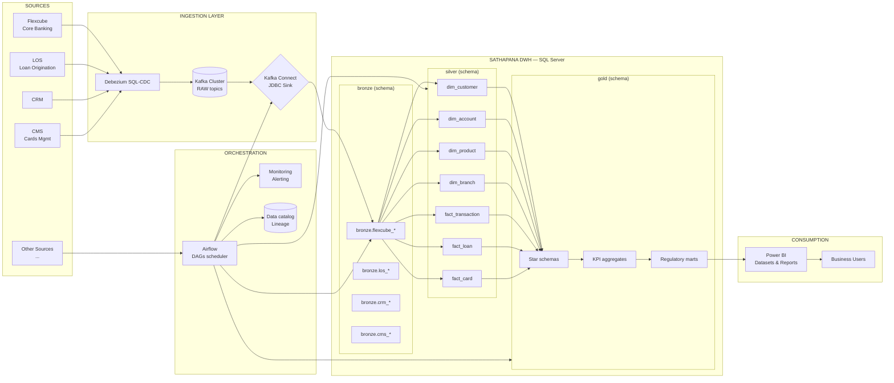

# Sathapana Bank — Data Warehouse Technical Specification (SPEC)

| Item | Value |
|---|---|
| **Document** | DWH Architecture & Technical Specification |
| **Version** | 0.1 (Draft) |
| **Status** | Proposed / Under Review |
| **Owner** | Data Engineering & Architecture (Sathapana Bank) |
| **Date** | 2026-09-13 |
| **Audience** | Data Engineering, Data Architecture, BI, Infrastructure, Risk & Compliance |

---

## Table of Contents

1. [Purpose & Objectives](#1-purpose--objectives)
2. [Scope](#2-scope)
3. [Architecture Overview](#3-architecture-overview)
4. [Reference Architecture Diagram](#4-reference-architecture-diagram)
5. [Source Systems](#5-source-systems)
6. [Data Ingestion & CDC (Debezium + Kafka)](#6-data-ingestion--cdc-debezium--kafka)
7. [Medallion Layering (Bronze / Silver / Gold)](#7-medallion-layering-bronze--silver--gold)
8. [SQL Server Database & Storage Design](#8-sql-server-database--storage-design)
9. [ELT Strategy](#9-elt-strategy)
10. [Airflow Orchestration & Scheduling](#10-airflow-orchestration--scheduling)
11. [Power BI Reporting Layer](#11-power-bi-reporting-layer)
12. [Data Model Design (Dimensional)](#12-data-model-design-dimensional)
13. [Data Quality](#13-data-quality)
14. [Data Governance, Security & Compliance](#14-data-governance-security--compliance)
15. [Metadata, Lineage & Data Catalog](#15-metadata-lineage--data-catalog)
16. [Monitoring, Observability & Alerting](#16-monitoring-observability--alerting)
17. [SLAs & Batch Window Management](#17-slas--batch-window-management)
18. [Backup, DR & Retention](#18-backup-dr--retention)
19. [Environments & CI/CD](#19-environments--cicd)
20. [Team & RACI](#20-team--raci)
21. [Naming Conventions & Standards](#21-naming-conventions--standards)
22. [Delivery Roadmap](#22-delivery-roadmap)
23. [Risks & Mitigations](#23-risks--mitigations)
24. [Open Questions](#24-open-questions)

---

## 1. Purpose & Objectives

Establish a single, authoritative **enterprise data warehouse (DWH)** for Sathapana Bank that consolidates data from all primary business systems into a governed, trusted, analysis-ready platform.

### Primary Objectives

1. **Single Source of Truth (SSOT)** for financial & customer data across retail, SME and corporate banking lines.
2. **Regulatory reporting** readiness for NBC (National Bank of Cambodia) and internal Risk/Compliance reporting.
3. **360° customer view** by linking Customer, Account, Loan, and Card data across systems.
4. **Real-time / near-real-time ingestion** via Change Data Capture (CDC) for operational & analytics needs.
5. **Scalable medallion architecture** supporting incremental growth in sources, volume and consumers.
6. **Self-service BI** for business users via Power BI with governed semantic models.
7. **Full lineage, auditability and retention** to satisfy internal audit and regulatory requirements.

### Success Criteria (KPIs)

| KPI | Target |
|---|---|
| End-to-end ingestion latency (source → Gold) | CDC: ≤ 15 min; Batch: ≤ T+1 04:00 |
| Data completeness | ≥ 99.9% per load |
| Data quality pass rate | ≥ 95% first run, trending to 99% |
| Bronze/Silver/Gold job success SLA | ≥ 99.5% weekly |
| Regulatory report availability | T+1 08:00 AM Phnom Penh time |

---

## 2. Scope

### In Scope

- CDC-based ingestion from Flexcube (Core Banking), LOS, CRM, CMS (Cards) and initial "etc." systems.
- Medallion data layers (Bronze, Silver, Gold) in SQL Server.
- Airflow DAG orchestration for all load pipelines.
- Power BI semantic models and dashboards.
- Data quality, governance, security, lineage and monitoring framework.

### Out of Scope (MVP)

- Real-time serving layer (until Gold is stable).
- Advanced machine-learning feature store (future roadmap).
- Master Data Management (MDM) tooling (lightweight conformed dims handled in Silver).
- Export of batch files to external regulators via the DWH (consumed from Gold instead).

---

## 3. Architecture Overview

The platform uses a **Medallion architecture** with three progressively refined layers:

```
+-------------+     +-------------+     +-------------+     +-------------+
| Source      |---->| Ingestion   |---->| Bronze      |---->| Silver      |
| Systems     |     | CDC / Batch |     | (raw,immut) |     | (clean,std) |
+-------------+     +-------------+     +-------------+     +-------------+
                                                                  |
                                                                  v
+-------------+     +-------------+     +-------------+
| Power BI    |<----| Gold        |<----| Facts & BODs|
| (semantic)  |     | (dim model) |     | (Kimball)   |
+-------------+     +-------------+     +-------------+
```

- **Data flows left → right** through increasing refinement.
- **Metadata, quality and lineage** flow along the entire pipeline.
- **Airflow** is the single orchestration control plane.
- **SQL Server** is the physical warehouse (Bronze, Silver, Gold in dedicated schemas).
- **Kafka + Debezium** streams CDC events; batch ingestion covers non-CDC sources / initial backfill.

---

## 4. Reference Architecture Diagram



---

## 5. Source Systems

| System | Type | Ingestion Method | Landscape | Remarks |
|---|---|---|---|---|
| **Flexcube** (Oracle FS) | Core Banking — General Ledger, Accounts, Deposits, Transactions | **CDC (Debezium)** + Initial Snapshot | OLTP DB (Oracle) | Highest volume; authorized sources of truth for balances & transactions. |
| **LOS** | Loan Origination System | CDC + Batch | OLTP DB / API | Loan applications, decisions, disbursements, rollovers. |
| **CRM** | Customer Relationship Mgmt | CDC + Batch | OLTP DB | Customer interactions, KYC, segment, appetites. |
| **CMS** | Card Management System | CDC + Batch | OLTP DB | Card issuance, PIN, usage transactions, merchant data. |
| **Other (TBD)** | e.g., Mobile/Internet Banking, TF (Trade Finance), Treasury, AML | Batch / API / CDC (based on capability) | — | Onboarded iteratively in Phase list (§22). |

### Per-Source Contract Requirement

Every new source must provide (documented in the data catalogue):

- Connection/access method (replication user, API credentials, file drop).
- Tables/objects list with owner (a.k.a. "data steward").
- Business meaning of each column (data dictionary).
- Volume & change-rate estimates.
- Retention & residency expectations.

---

## 6. Data Ingestion & CDC (Debezium + Kafka)

### 6.1 Strategy

| Pattern | Used For |
|---|---|
| **CDC via Debezium + Kafka** | High-rate, high-importance OLTP tables (Flexcube GL/acc/transactions, LMS, CMS card transactions). |
| **Batch (SQL Server scheduled via Airflow)** | Initial historical backfill, low-change reference/master data, file-based sources. |
| **API pull (Airflow)** | Sources without CDC access or with API-only data (e.g., some SaaS CRM/AML). |

### 6.2 CDC Pipeline Detail

```
Source DB  -->  Debezium SQL Server/Oracle Connector  -->  Kafka Topic  -->  Kafka Connect JDBC Sink  -->  SQL Server [bronze]
        (log-based, e.g. Oracle LogMiner / SQL Server CDC)    (RAW topic)          (upsert / delta)
```

1. **Debezium source connector** reads the source's transaction log with log-based CDC (no changes to source app).
2. Events published to **RAW Kafka topics**, keyed by primary key (ensures per-key ordering).
3. Event envelope includes CDC control fields (see 6.4).
4. **Kafka Connect JDBC Sink connector** applies events into the corresponding `bronze.*` table as incremental upserts (MERGE).
5. **Initial snapshot** is performed once per table (Debezium snapshot) or via Airflow backfill, then the pipeline switches to streaming.

### 6.3 Topic Design

| Topic | Naming Pattern | Partitioning | Retention |
|---|---|---|---|
| `fcb.<schema>.<table>.raw` | `<system>.<obj>.raw` | By PK hash | Compacted (keyed) |
| Dead-letter topics | `<system>.<obj>.dlq` | By PK hash | 7 days |

Topic naming exemplars:
- `fcb.CBS_ACCOUNT.raw`
- `fcb.CBS_TRAN_HEADER.raw`
- `los.LOAN_APPLICATION.raw`
- `cms.CARD_TRANSACTION.raw`
- `crm.CUSTOMER.raw`

### 6.4 CDC Envelope (Bronze metadata columns)

Each bronze table carries (in addition to source columns):

| Column | Type | Purpose |
|---|---|---|
| `_cdc_op` | `varchar(1)` | Operation: `r`=read(snapshot), `i`=insert, `u`=update, `d`=delete |
| `_cdc_lsn` | `numeric(25,0)` | Log sequence / binlog position (ordering) |
| `_cdc_ts_ms` | `datetime2(7)` | Source event timestamp |
| `_ingest_ts` | `datetime2(7)` | Sink load timestamp (server local) |
| `_batch_id` | `bigint` | Airflow run id of the pipeline that loaded it |
| `_is_deleted` | `bit` | `1` when `_cdc_op = 'd'` (soft tombstone for audit) |

> **Delete strategy:** Bronze **never hard-deletes**. Deletes are soft-tombstoned (`_is_deleted = 1`); physical purges only occur under documented retention policies.

### 6.5 Kafka & Debezium Implementation Notes

- Debezium connectors: **Oracle** (via LogMiner/XStream or Oracle GoldenGate alternative) and **SQL Server CDC** connectors, run in distributed mode.
- Connector configs stored outside source systems (e.g., Kafka Connect too + config in Git for reproducibility).
- Schema registry (e.g., Confluent Schema Registry / Apicurio) serving Avro schemas for topics.
- At-least-once delivery: Silver layer must be **idempotent** (dedupe on `_cdc_lsn`/PK) to re-run safely.
- Partitioning by PK keeps per-key ordering; ordering across partitioned key guaranteed by LSN watermark.
- **Airflow monitors progress**: watermark lag = difference between max `_cdc_lsn` in bronze vs. source log position.

### 6.6 Initial Backfill Rules

- Backfills run **table-by-table** through Airflow (`backfill_<table>` DAG) so they can be rerun without breaking streaming.
- Streaming is paused per topic during backfill to preserve ordering; resume after backfill watermark.
- All backfills write through the same Bronze tables so Silver/Gold never distinguishes "backfill vs CDC" rows.

---

## 7. Medallion Layering (Bronze / Silver / Gold)

### 7.1 Bronze — Raw, Immutable Landings

| Aspect | Definition |
|---|---|
| Purpose | Land raw data from sources with **zero transformation**, one row per source record (or CDC event). |
| Schema | `bronze` |
| Conventions | One table per source object: `bronze.<system>_<source_table>`. Each row preserves source values & CDC envelope (§6.4). |
| DDL styles | HEAP or clustered index on `_ingest_ts`/PK; **no** FK constraints, no business rules, no cleaning. |
| Key rules | No deletes (soft tombstone only); no joins across sources in this layer. |

### 7.2 Silver — Clean, Conformed, Integrated

| Aspect | Definition |
|---|---|
| Purpose | Integrate, de-duplicate, standardize, type, and conform data. This is the **integration layer** (≥ ODS quality). |
| Schema | `silver` |
| Contents | Conformed **dimensions** & **fact/base tables** (staging quality that Gold consumes). |
| Conventions | `dim_*`, `fact_*` tables. All codes normalized, dates standard `DATE`/`DATETIME2`, amounts `DECIMAL(19,4)`+currency columns, names/text trimmed & valid-UTF8, null-handling documented. |
| SCD | SCD-2 for slow-changing dimensions (e.g., customer segment, account status), SCD-1 for corrections. |
| DDL styles | Clustered indexes on natural keys + PK/surrogate keys; filtered indexes where needed. |
| Quality | Every Silver table bound to at least one DQ rule set (§13). Unresolvable rows land in quarantine tables `silver._quarantine_*`. |

### 7.3 Gold — Dimensional Marts for Business Consumption

| Aspect | Definition |
|---|---|
| Purpose | Curated, business-approved facts/dimensions & aggregates for reports, KPIs and regulatory returns. |
| Schema | `gold` |
| Contents | Star schemas (conformed dims + facts), KPI/aggregate tables, regulatory-specific marts. |
| Conventions | `fact_*`, `dim_*`, `agg_*`, `rpt_*`. Grain defined per fact and documented. |
| DDL styles | **Clustered Columnstore** for large facts; standard rowstore for dims/aggregates. |
| BI | Power BI connections target Gold (+ certified semantic datasets). |

### 7.4 Layer Hand-off Rules

- Only **Silver** tables marked `is_approved + certified` may feed Gold.
- Gold refresh requires Silver table **quality gates** = PASS.
- No direct Bronze → Gold or Source → Gold marts (ensures single processing path & auditability).

---

## 8. SQL Server Database & Storage Design

### 8.1 Instances / Databases

| Database | Purpose |
|---|---|
| `SATHAPANA_DWH` | Bronze + Silver + Gold schemas (logical medallion layers in one physical DB; filegroup segregation recommended). |
| `SATHAPANA_META` | Airflow meta tables, lineage, watermark store, data-quality results, run history. |
| `STAGING_*` (if needed) | Ad-hoc bulk landing for file/API batch loads before Bronze. |

Schema-per-layer on one database with **separate filegroups**:

| Filegroup | Contents | Storage Type |
|---|---|---|
| `FG_BRONZE` | bronze tables | High-throughput SSD (write-heavy) |
| `FG_SILVER` | silver tables | Balanced |
| `FG_GOLD` | gold tables/marts | Fast read (columnstore) + dedicated |
| `FG_META` | meta/catalog | Compact |

### 8.2 Physical Design Standards

- **Compression:** PAGE on Bronze & Silver; COLUMNSTORE on Gold facts.
- **Partitioning:** High-volume facts partitioned by `PARTITION_MONTH` (calendar month), sliding window on facts ≥ 500M rows or ≥ 10 GB.
- **Indexing:**
  - Bronze: HEAP or clustered IX on `_batch_id`,`_ingest_ts`; unique filtered index on business PK where sensible.
  - Silver dims: PK on surrogate `_key`, unique IX on natural/business key.
  - Silver facts: clustered IX on grain keys; filtered IX for active-day queries.
  - Gold facts: Clustered Columnstore (CCI); rowstore PK on dims.
- **Statistics:** auto-create + auto-update statistics ON; full statistics refresh in maintenance window.
- **Isolation:** `READ COMMITTED SNAPSHOT` consideration to avoid reader/writer blocking during ELT.
- **TempDB** sized appropriately for columnstore & big MERGEs (≥ 4 files, equal size) — confirm with storage team.
- **Memory:** Gold scan workloads → enable tiered memory, service object swapped for operators; coordinate on capacity planning.

### 8.3 Golden Rules

- All DDL & deployment via scripts (Git) — no ad-hoc schema changes in prod.
- `DBCC CHECKDB` weekly; backups continuous.
- Row-level security (RLS) enforced in Gold for branch/role-based data isolation where required (see §14).

---

## 9. ELT Strategy

**ELT (Extract-Load-Transform)** — the SQL Server engine does the heavy transforming:

1. **Extract:** pulled by Debezium/Kafka (CDC) or by Airflow batch pulls into Bronze.
2. **Load:** data lands in Bronze with minimal to zero transformation.
3. **Transform:** big, set-based T-SQL in Silver/Gold — fully re-runnable (idempotent), no external compute.

Reasons: single compute engine, trackable SQL, incremental-friendly MERGEs, simple dependency management via Airflow, no separate transformation server.

### Incremental Strategy

| Layer | Approach |
|---|---|
| Bronze | Append CDC/backfill events; upsert by PK on replay; dedupe on `_cdc_lsn`. |
| Silver | Idempotent MERGE on natural keys; SCD-2 applied in dims; facts rebuilt for the current window only. |
| Gold | Point-in-time rebuild of the affected grain window (e.g., 1–7 days), then incremental append of new partitions. |

Every transformation DAG has an explicit `Full Refresh` overridable mode for remediation.

---

## 10. Airflow Orchestration & Scheduling

### 10.1 Deployment

- **Airflow 2.x** running in an HA configuration (multiple schedulers, Celery/Kubernetes executor as chosen) in Docker/VM.
- DAG code, plugins and providers versioned in Git; deployed via CI/CD.
- Time base: `Asia/Phnom Penh (UTC+7)` for scheduling (reports anchor to bank business day).

### 10.2 DAG Catalogue (MVP)

| DAG | Schedule | Purpose |
|---|---|---|
| `cdc_monitor_watermark` | every 5 min | Snapshot Kafka sink progress; alert on lag. |
| `ingest_cdc_<system>` | every 10 min | Verify topics consumed, sign-off bronze watermarks. |
| `backfill_<system>_<table>` | ad-hoc | One-time / catch-up backfills to Bronze. |
| `silver_build_dimensions` | daily 01:00 | Conform & SCD-2 update all `dim_*`. |
| `silver_build_facts` | daily 02:00 | Load `fact_*` for current window. |
| `gold_build_marts` | daily 03:00 | Refresh Gold stars, KPIs, regulatory marts. |
| `powerbi_semantic_refresh` | daily 04:00 | Trigger Power BI dataset refresh (or after `gold_build_marts`). |
| `dq_scan_daily` | daily 00:30 | Run DQ rule sets across Silver/Gold; publish results. |
| `meta_publish_lineage` | hourly | Collect lineage snapshots into catalog for auditing. |

### 10.3 DAG Standards

- Data dependencies expressed via **external task sensors** (XCom only for small metadata).
- Every task: idempotent, sets `_batch_id = run_id`, retries (3, exponential backoff), SLAs alerted.
- **Contract tests** → each DAG must pass a dry-run in dev before promotion.
- Variable/Connection secrets via Airflow secrets backend (e.g., Azure Key Vault / SSM) — never in code.

### 10.4 Example DAG Sketch (pseudocode)

```
silver_build_facts:
  [await bronze watermark OK]
  -> silver.merge_fact_transaction (T-SQL)
  -> dq.verify_fact_transaction
  -> publish status to meta
```

---

## 11. Power BI Reporting Layer

### 11.1 Model Design

- **Connection mode:** connect to Gold tables/views via DirectQuery for large facts; **Import** for dims/aggregates.
- **Semantic model** (one per domain): Retail Banking, Loans, Cards, Finance & GL, Regulatory.
- **Star-schema compliant** datasets built on `gold.fact_*` + `gold.dim_*` (certified datasets) — no ad-hoc data pulls from Silver/Bronze for prods.
- **Row-level security (RLS):** branch managers see their branch(es); role-based views per access policy.
- **Refresh:** triggered by Airflow post-Gold via Power BI REST API; additionally scheduled fallback.

### 11.2 Report Portfolio (initial)

| Report | Source Mart |
|---|---|
| Daily Balance Sheet & P&L | `gold.agg_gl_daily` |
| Customer 360 Overview | `gold.fact_customer_360` + dims |
| Loan Portfolio & Delinquency | `gold.fact_loan` |
| Card Usage & Merchant Analytics | `gold.fact_card` |
| Regulatory/KPI Dashboard (exec) | `gold.rpt_nbc_kpi*` |

### 11.3 Governance Rules

- Workspaces: `Dev` → `Test` → `Prod`.
- Data steward approval gate before dataset certification in Prod.
- Versioned metadata (column descriptions, measures) stored in catalog; enforced via dataset build scripts.

---

## 12. Data Model Design (Dimensional)

### 12.1 Conformed Dimensions (Silver/Gold)

Initial conformed dimension set (shared across marts — the backbone of the 360 view):

- `dim_customer` — party/account-holder (SCD-2: segment, KYC status).
- `dim_account` — Flexcube accounts (SCD-2: status, product, branch).
- `dim_product` — product hierarchy (deposits/loans/cards mapped to statement lines).
- `dim_branch` — branch & region hierarchy (SCD-1/2).
- `dim_date` — bank calendar (working day flag, NBC day, period).
- `dim_channel` — branch, mobile, internet, ATM, card network, third-party.
- `dim_currency` — KHR, USD, THB, EUR & FX reference.
- `dim_staff` — relationship manager & teller (masked PII dimension).

### 12.2 Core Fact Tables (Gold)

| Fact | Grain | Suggested Keys |
|---|---|---|
| `fact_transaction` | One row per monetary transaction | `dim_account`, `dim_channel`, `dim_branch`, `dim_date`, `dim_currency` |
| `fact_loan_balance` | One row per loan per date | `dim_loan`/`dim_account`, `dim_product`, `dim_date` |
| `fact_card_transaction` | One row per card event | `dim_card`, `dim_channel`, `dim_merchant`, `dim_date` |
| `fact_customer_event` | One row per customer interaction | `dim_customer`, `dim_channel`, `dim_date` |
| `fact_gl_daily`/`agg_gl_daily` | GL movement daily per cost centre | `dim_account(COA)`, `dim_branch`, `dim_date` |

### 12.3 SCD Usage

| Type | Used for | Handling |
|---|---|---|
| SCD-0 | Immutable facts/timestamps | Never touched. |
| SCD-1 | Attribute corrections (e.g., misspelled name fix) | Overwrite, no history. |
| SCD-2 | Track history (segment, product, branch, address, status) | New row + `valid_from`/`valid_to`, current flag. |
| SCD-3 (if needed) | last-known-change | Optional, documented per attribute. |

### 12.4 Keys

- Surrogate keys `*_key BIGINT IDENTITY` on every Silver/Gold dimension.
- Natural keys retained as business keys (`source` + `source_id` pair — avoids collisions across systems).
- Facts reference only surrogate keys; no cross-system PK temptation.

---

## 13. Data Quality

### 13.1 DQ Framework (7 dimensions)

1. **Completeness** — no NULL on mandatory cols (e.g., txn amount, customer id).
2. **Validity** — format, range, domain (e.g., currencies ∈ {KHR, USD,…}).
3. **Accuracy/Consistency** — cross-foot GL balances between source sum and Silver facts.
4. **Uniqueness** — PK/business-key uniqueness on dims & CDC keys.
5. **Timeliness** — watermark/recency thresholds per source.
6. **Integrity** — orphan check: fact-dims FK logic satisfied.
7. **Reasonableness** — thresholds e.g., |amount| < 1e12 KHR; balance > -loan limit.

### 13.2 DQ Implementation

- Rule sets authored in **YAML/JSON** (checked into repo) and executed by `dq_scan_daily` / per-DAG `dq.verify_*` tasks.
- Results persisted to `SATHAPANA_META.dbo.dq_run`, `dq_result` tables.
- **Gates:** a DAG upstream will **fail-stop** certified Gold refresh if a block rule on its Silver input fails.
- **Quarantine:** failing Bronze→Silver rows land in `silver._quarantine_*`; steward resolves within SLA; report metric "aged quarantine".

### 13.3 Data Quality Metrics Targets

- Volume reconciliation: source counts == bronze counts (incl. tombstones) within ±0.1%.
- Monetary reconciliation: GL totals on Gold == core-banking GL totals daily.

---

## 14. Data Governance, Security & Compliance

### 14.1 Governance

- **Data owners/stewards** per source system (§5 contract). Stewards approve Silver/Gold definitions & certification.
- Business glossary & definitions owned by Business Data Stewardship forum.
- Certification workflow: candidate dataset → steward review → `certified` flag in catalog → publish to Power BI.

### 14.2 Security & Access

- **Least privilege** at all layers.
  - Bronze/Silver: SQL logins for pipeline & DQ only (no direct user querying for prod users).
  - Gold: read-only roles per domain; RLS on fact marts for branch/sensitivity.
- **PII classification**: customer identity, addresses, documents, card numbers = **Confidential/PII**; tokenize PANs at silver+ (CMS PAN → token), mask at report-level.
- **Encryption**: TDE for SQL Server DB(s) at rest; TLS/SASL for Kafka; encrypted channels for CDC to source; secrets in vault.
- **Auditing**: built-in auditing on Gold sensitive tables; `LOGIN`/`DDL` audit enabled; CDC & Airflow audit trails retained (per NBC & internal policy).

### 14.3 Compliance & Regulatory

- **NBC (National Bank of Cambodia)** reporting requirements (e.g., FX, credit, liquidity reports) produced from auditable Gold marts.
- **Credit Bureau** (Cambodia) data exports sliced from Silver/Gold with dedicated controllers.
- **PCI-DSS**: card data (CMS) — scope limited to tokenization point; raw PANs never stored in Gold; bronze retention restricted & encrypted.
- **BCP/DR** for DWH must meet internal critical-system RTO/RPO (see §18).
- **Data residency:** all DWH data stays in Cambodia (in-country DB/Kafka), consistent with bank policy.

---

## 15. Metadata, Lineage & Data Catalog

- **Operator model:** table-level lineage enforced in Airflow (each task declares inputs/outputs), enriched with column-level lineage from SQL parsers in CI.
- Catalog stores: data dictionary, DQ rules, certification status, owners, usage/report links.
- **Watermark store** in `SATHAPANA_META` (per source/table: last `_cdc_lsn`, `_ingest_ts` — used for lag monitoring & backfill coordination).
- Catalog is the contract reference for new sources and for Power BI dataset builders.

---

## 16. Monitoring, Observability & Alerting

| Layer | Metrics | Tooling |
|---|---|---|
| Kafka/Debezium | Consumer lag, errors, DLQ count | Prometheus + Grafana / CMK dashboards |
| Airflow | DAG duration, sla_miss, failed tasks | Airflow UI + webhooks; issue tracker/Hookbot |
| SQL Server | Load durations, blocking, waits, DB growth, backup health | DMVs + custom monitoring jobs |
| DQ | Pass %, quarantine age, reconciliation deltas | Meta DB + notification on breach |
| Power BI | Refresh status/latency | Power BI admin + API checks |

Alert routing: `#dwh-alerts` (ops) vs `#dwh-dq` (stewards) vs `#dwh-reporting` (BI). All alerts actionable: severity + owner + link to run log.

---

## 17. SLAs & Batch Window Management

- **Daily batch window:** 00:30 → 05:00 Phnom Penh time (Silver+Gold complete by 04:00, Power BI by 05:00).
- **CDC latency SLA:** watermark lag ≤ 15 minutes (monitored every 5 min).
- **Recovery on failure:** DAG rerun within 30 min; auto-retry (3x) before paging.
- **Maintenance window:** Sundays 01:00–03:00 (index/statistics/DBCC), outside batch.
- **Versioned results:** Gold marts carry `as_of_date`/`run_id` so consumers can reproduce a reported figure.

---

## 18. Backup, DR & Retention

| Object | Backup Policy | Recovery Point | Retention |
|---|---|---|---|
| SQL Server DBs | Full nightly + diff hourly + log continuous | ≤ 15 min | 30 days backups |
| Kafka topics | Replication factor ≥ 3; remote replicator to DR region (if dual-region) | ≤ topic retention | Bronze topics compacted; RAW streams other than bronze mirrored |
| Airflow | scheduler state + DAG defs in Git; meta DB backed-up | ≤ 15 min | — |

- **DR:** Active-passive secondary (in-country, separate site recommended); RTO ≤ 4 h, RPO ≤ 15 min for DWH (aligned with bank tier).
- **Retention (data):** Bronze raw 3 years (extendable for legal), Silver/Gold 10 years (regulatory), quarantines 90 days unless legal hold.
- Legal holds implemented as row-level flags; **no purge** under hold.

---

## 19. Environments & CI/CD

| Env | Use | Data |
|---|---|---|
| `dev` | Development, DAG authoring, table dev | anonymized mini-dataset |
| `test/qa` | Integration, DQ gates, report validation | synthetic + masked prod subset |
| `preprod` (optional) | Dry-run of night batch | masked |
| `prod` | Certified pipelines & reports | real |

- **CI:** SQL unit tests + DAG contract tests gated by PR.
- **CD:** automated promotion of DDL + DAG code + Power BI workspace (dev→test) via approvals to prod.
- All environments share identical server version/SQL compatibility level to avoid drift.

---

## 20. Team & RACI

| Role | Responsibility |
|---|---|
| Data Architect | Medallion schemas, conventions, roadmap |
| Data Engineers | Ingestion, Airflow DAGs, T-SQL transforms, DQ pipelines |
| Data Stewards/Business SMEs | Glossary, certification, rule ownership, remediation |
| BI Analysts | Power BI semantic models & reports on Gold |
| Platform/Infra Engineering | SQL Server, Kafka clusters, networking, backup/DR |
| InfoSec | Security policies, RLS validation, key management |

RACI per workstream (Ingestion / Transformation / DQ / Reporting / Infra) maintained in the project working repo — each workstream: an accountable Data Eng lead + a business counterpart steward.

---

## 21. Naming Conventions & Standards

### 21.1 Schemas

`bronze`, `silver`, `gold`, `meta` (and `staging_*` if transient).

### 21.2 Object Naming

| Object | Pattern | Example |
|---|---|---|
| Bronze table | `bronze.<system>_<source_table>` | `bronze.flexcube_cbs_trans_header` |
| Silver dim | `silver.dim_<name>` | `silver.dim_customer` |
| Silver fact/base | `silver.fact_<name>` | `silver.fact_transaction` |
| Gold dim (shared) | `gold.dim_<name>` | `gold.dim_branch` |
| Gold fact | `gold.fact_<name>` | `gold.fact_loan_balance` |
| Gold aggregate | `gold.agg_<grain>` | `gold.agg_gl_daily` |
| Regulatory mart | `gold.rpt_<report>` | `gold.rpt_nbc_credit` |
| Quarantine | `silver._quarantine_<name>` | `silver._quarantine_fact_transaction` |
| Airflow DAGs | `domain_action[_sub]` | `silver_build_facts`, `gold_build_marts` |

### 21.3 Column Conventions

- Surrogate key: `<entity>_key` (e.g., `customer_key`).
- Natural/business key: `<source>_id` + `source_system` retained.
- Timestamps: `*_ingest_ts`, `*_loaded_ts`, `valid_from_ts`, `valid_to_ts`.
- Amounts: `*_amt DECIMAL(19,4)` with companion `*_currency`.
- Flags: `is_* BIT` / `*_flag`; status: `*_status VARCHAR` domain-coded.
- All columns snake_case; booleans named `is_*`. Password/secrets never stored in DB.

### 21.4 Style Rules

- T-SQL: semicolons, explicit `MERGE`/`UPDATE FROM`, no `SELECT *` in transforms, always `WITH (NOLOCK)` only where justified on read-only batch, or rely on snapshot isolation.
- Jinja templates for parameterized DAG tasks; SQL kept in separate `.sql` files (not inline strings) where length allows.

---

## 22. Delivery Roadmap

| Phase | Duration | Milestones |
|---|---|---|
| **P0 — Foundation** | Wk 1–4 | SQL Server + Airflow + Kafka/Debezium infra; Meta DB; naming standards; Bronze for Flexcube core tables; watermark monitoring. |
| **P1 — Core Banking (Flexcube)** | Wk 5–10 | Full Flexcube bronze; Silver dims (customer, account, product, branch, date); Silver/Fact GL & transactions; DQ framework v1. |
| **P2 — CRM + LOS** | Wk 11–16 | CDC/batch for CRM & LOS; customer 360 conformed identity; loan fact marts; SCD-2 operational. |
| **P3 — Cards (CMS)** | Wk 17–20 | Card transactions marts; PAN tokenization; merchant dimension; PCI scope green. |
| **P4 — Reporting** | Wk 21–26 | Power BI semantic models on Gold; exec dashboards; RLS; report certification. |
| **P5 — Regulatory** | Wk 27–30 | NBC & Credit Bureau marts; reconciliation to GL; audit/retention sign-off. |

Each phase gate: DQ gates PASS, reconciliation signed-off by stewards, runbook/doc updated, DR tested.

---

## 23. Risks & Mitigations

| # | Risk | Impact | Mitigation |
|---|---|---|---|
| 1 | Flexcube CDC licensing/compatibility (Oracle) limits source connector | Delays core channel | Evaluate Oracle GoldenGate alternative; prototype early (P0/P1); keep batch fallback. |
| 2 | Source schema changes without notice | Pipeline breaks | Schema-on-load validation in Bronze; contract tests; alert on drift; Debezium schema registry versioning. |
| 3 | Ordering/duplicate CDC events | Wrong numbers in Gold | Per-key ordering + dedupe on LSN; idempotent MERGEs; reconciliation every run. |
| 4 | Silver mismatch w/ source balances | Trust erosion | GL-foot reconciliations nightly; quarantine + steward SLA. |
| 5 | Batch window overruns | Late reports | Incremental windowing, partition pruning, scale-up (columnstore/parallelism) validated in P1. |
| 6 | PII/PAN leakage | Regulatory/PCI breach | Tokenization at silver; RLS; encryption; limited bronze PAN retention; audits. |
| 7 | Data owner non-response on quality | Stale certified datasets | Steward SLA + escalation to DWH steering committee. |
| 8 | Kafka/SQL Server ops complexity | Infra cost/outages | Managed services preferred where permitted; runbooks; DR drills in P0/P5. |

---

## 24. Open Questions

1. Confirm Flexcube CDC approach: Debezium Oracle connector (LogMiner/XStream) vs Oracle GoldenGate vs native flexcube proprietary interfaces.
2. Exact volume/rows-per-day for Flexcube transaction tables (drives partitioning & cluster size).
3. Source systems for the "etc." group (mobile banking, treasury, AML?) and their CDC/API capability.
4. Network access between source Oracle/DBs ↔ Kafka ↔ SQL Server in the bank DC (segmentation rules).
5. NBC reporting format/table specifications and cut-off times to be confirmed with Compliance.
6. Airflow executor choice (Celery vs Kubernetes) given existing container platform.
7. Does bank Treasury require near-real-time (intraday < 1 min) any report, beyond 15-min SLA?

---

*Document is living — update version on approved changes. Companion artifacts: architecture decision records (ADRs), data dictionary, DQ rule catalog, runbooks.*